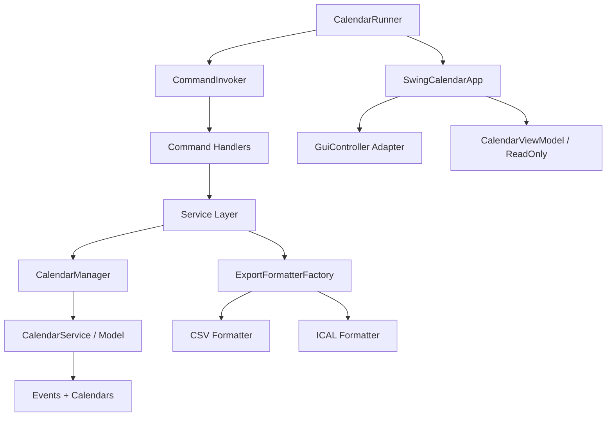

# Virtual Calendar — Bible Document

## 1) 30-Second Pitch (Role-Specific Versions)

### Backend Engineer Pitch
I built **Virtual Calendar**, a Java 11 calendar platform that supports multi-calendar timezone isolation, recurring event logic, series-level edits, copying across date ranges, analytics, and dual interfaces (CLI + Swing GUI). The architecture separates command parsing, services, and domain modeling, with exporter abstractions for CSV/ICAL and a CI-backed quality workflow.

### Full-Stack / Product Engineer Pitch
Virtual Calendar is a complete scheduling system with a desktop GUI and scriptable CLI, designed for real-world operations: create/edit recurring events, duplicate schedules between teams, run date-range analytics, and export in interoperable formats. I focused on clean layering and extensibility, so adding APIs or cloud persistence later is straightforward.

### QA / SDET Pitch
This project is a test-heavy Java application with broad command and service coverage (commands, event lifecycle, export behavior, GUI headless checks, date utilities). I designed it to support deterministic command-driven testing and report quality through Gradle test pipelines and CI.

### Data / Analytics Pitch
Beyond CRUD, the project computes practical calendar intelligence—event volume by day/week/month, busiest/least-busy day, and online vs non-online split—useful for operational planning, utilization tracking, and downstream BI.

---

## 2) What the Project Does (Plain English)
Virtual Calendar lets users create multiple named calendars (each in its own timezone), add normal or recurring events, edit one event or many future/series instances, query availability and schedules, copy events between calendars and dates, and export to CSV/ICS.

---

## 3) What Problem It Solves
Most lightweight scheduling tools either:
- handle only one calendar,
- don't support robust recurring edits,
- can't be automated from scripts,
- or don't expose analytics/export.

This project solves those gaps by combining:
- **human-friendly CLI automation**,
- **visual Swing interaction**,
- **structured export formats**,
- **analytics for decision making**,
- and **timezone-aware multi-calendar operations**.

---

## 4) Architecture Deep Dive (with diagram)

### Layered Design
- **Entry Point**: `CalendarRunner`
- **Controller Orchestration**: `CommandInvoker`, command handlers
- **Service Layer**: Event/query/copy/export services
- **Domain Model**: CalendarService, Event, analytics model
- **Presentation**: Console view + Swing view/viewmodel

### Diagram (Mermaid)


### Why this architecture works
- Command parsing complexity is isolated from business logic.
- GUI actions are mediated via controller adapter, not direct model mutation.
- Export strategy pattern makes file format additions low-risk.

---

## 5) Data/System Flow — Step by Step
1. User enters CLI command (or triggers GUI action).
2. Command routed through invoker/adapter.
3. Command object parses parameters and validates syntax.
4. Service layer executes operation-level logic.
5. Manager/model mutate calendar/event state.
6. Console output (or GUI refresh through read-only projection) reflects latest state.
7. Optional export serializes state to CSV/ICAL.

---

## 6) Tech Stack — What & Why Each Choice
- **Java 11 target**: stable language/runtime for enterprise-like OOP patterns.
- **Gradle**: dependency/task orchestration and CI compatibility.
- **JUnit 4**: broad unit tests, command/service-level verifications.
- **Swing**: native desktop UI with low dependency overhead.
- **Checkstyle + JaCoCo + PIT config**: code quality, coverage, mutation quality gates.

---

## 7) Project File Structure — Every File Explained

### Root / Config
- `README.md`: usage and command reference.
- `build.gradle`: plugins, dependencies, test/quality tasks, PIT config.
- `settings.gradle`: Gradle project naming/settings.
- `.github/workflows/ci.yml`: CI build/test on push/PR.
- `config/checkstyle/checkstyle.xml`: style enforcement rules.
- `questionnaire.txt`, `USEME.md`: project/supporting docs.

### Runtime Resources (`res/`)
- `commands.txt`: sample headless execution script.
- `*.csv`, `*.ical`, `*.ics`: sample exported artifacts.
- `*.jpeg`, `Misc.md`: supporting visuals/notes.
- `invalid.txt`: invalid-input sample.

### Source (Main)
- `src/main/java/CalendarRunner.java`: app entry, mode selection, loop bootstrap.
- `src/main/java/calendar/model/IEvent.java`: event abstraction contract.
- `src/main/java/calendar/model/Event.java`: event entity and behavior.
- `src/main/java/calendar/model/CalendarModel.java`: calendar model abstraction.
- `src/main/java/calendar/model/CalendarService.java`: central model implementation.
- `src/main/java/calendar/model/CalendarAnalytics.java`: analytics calculations.
- `src/main/java/calendar/controller/CalendarManager.java`: orchestration facade over model.
- `src/main/java/calendar/controller/GuiController.java`: GUI interaction interface.
- `src/main/java/calendar/controller/services/CalendarService.java`: calendar-related operations.
- `src/main/java/calendar/controller/services/EventService.java`: event create/edit operations.
- `src/main/java/calendar/controller/services/CopyService.java`: copy operations.
- `src/main/java/calendar/controller/services/QueryService.java`: query/status retrieval.
- `src/main/java/calendar/controller/services/ExportService.java`: export workflow.
- `src/main/java/calendar/controller/export/ExportFormatter.java`: formatter contract.
- `src/main/java/calendar/controller/export/CsvExportFormatter.java`: CSV serializer.
- `src/main/java/calendar/controller/export/IcalExportFormatter.java`: ICAL serializer.
- `src/main/java/calendar/controller/export/ExportFormatterFactory.java`: format resolver.
- `src/main/java/calendar/controller/commands/Command.java`: command interface.
- `src/main/java/calendar/controller/commands/CommandInvoker.java`: top-level command dispatch.
- `src/main/java/calendar/controller/commands/CommandInvokerControllerAdapter.java`: GUI-to-command adapter.
- `src/main/java/calendar/controller/commands/CreateCalendarCommand.java`: calendar create parsing.
- `src/main/java/calendar/controller/commands/UseCalendarCommand.java`: active calendar switch.
- `src/main/java/calendar/controller/commands/EditCalendarCommand.java`: calendar edit parsing.
- `src/main/java/calendar/controller/commands/CreateEventCommand.java`: event create parsing.
- `src/main/java/calendar/controller/commands/EditEventCommands.java`: event edit parsing.
- `src/main/java/calendar/controller/commands/CopyCommands.java`: copy command parsing.
- `src/main/java/calendar/controller/commands/QueryCommands.java`: print/status commands.
- `src/main/java/calendar/controller/commands/ExportCommand.java`: export command parsing.
- `src/main/java/calendar/controller/commands/ShowCalendarDashboardCommand.java`: analytics command.
- `src/main/java/calendar/view/CalendarView.java`: view output contract.
- `src/main/java/calendar/view/ConsoleView.java`: stdout/stderr view implementation.
- `src/main/java/calendar/view/CalendarReadOnly.java`: GUI read-only projection contract.
- `src/main/java/calendar/view/CalendarViewModel.java`: read-model adapter for GUI.
- `src/main/java/calendar/view/SwingCalendarView.java`: GUI view contract/implementation layer.
- `src/main/java/calendar/gui/SwingCalendarApp.java`: main Swing app shell.
- `src/main/java/calendar/gui/CreateEventDialog.java`: event-create form.
- `src/main/java/calendar/gui/CreateRecurringDialog.java`: recurring-create form.
- `src/main/java/calendar/gui/EditEventDialog.java`: event edit form.
- `src/main/java/calendar/gui/AnalyticsDialog.java`: dashboard UI.
- `src/main/java/calendar/util/DateTimes.java`: datetime parse/format helpers.
- `src/main/java/calendar/util/DayCodes.java`: recurring day code parsing.

### Source (Tests)
- `src/test/java/CalendarTest.java`, `CalendarRunnerTest.java`: app-level behavior tests.
- `src/test/java/calendar/model/*`: model/analytics/event tests.
- `src/test/java/calendar/controller/*`: manager, command, export, service tests.
- `src/test/java/calendar/view/*`: view and viewmodel tests.
- `src/test/java/calendar/gui/*`: GUI headless/behavior tests.
- `src/test/java/calendar/util/*`: utility date parsing tests.

---

## 8) Code Walkthrough — Key Snippets Explained

### Unified launch path
`CalendarRunner` wires model, manager, view, and command invoker once, then chooses GUI/interactive/headless mode from CLI args.

### Command pattern usage
`CommandInvoker` delegates to command handlers (`CreateEventCommand`, `EditEventCommands`, etc.), minimizing condition-heavy logic in the entrypoint.

### Export strategy
`ExportFormatterFactory` picks `CsvExportFormatter` or `IcalExportFormatter` based on extension, keeping export logic open for extension.

### GUI decoupling
GUI mutates state through `GuiController` adapter and reads through `CalendarReadOnly`, which protects model internals and supports testability.

---

## 9) Database/Data Model (Schema, ERD, Relationships)
There is **no external database** in current version; storage is in-memory model objects.

### Logical ERD (conceptual)
```text
Calendar (name, timezone)
  1 ─── * Event (subject, start, end, allDay, location, description, visibility ...)
```

Relationships:
- One calendar holds many events.
- Recurring series are represented through repeated event instances (same subject/pattern metadata depending on operation).

---

## 10) Key Features & Unique Differentiators
- Multi-calendar with independent timezones.
- Single + recurring events with rich edit scopes (single/future/series).
- Cross-calendar and cross-date copy operations.
- Dual interface model (scriptable CLI + GUI).
- Analytics dashboard in both command and visual contexts.
- Multi-format export (CSV + ICAL).

---

## 11) Configuration / Environment Variables Reference
Current project has **minimal env config**.

| Variable | Required | Purpose |
|---|---:|---|
| `JAVA_HOME` | Recommended | Ensures a compatible Java runtime for Gradle/tasks. |

Primary runtime configuration is via CLI args:
- `--mode gui`
- `--mode interactive`
- `--mode headless <file>`

---

## 12) How to Run — Complete Setup Guide
1. Install Java (project targets Java 11 behavior).
2. From repo root run:
   - `./gradlew clean build`
3. Run one of:
   - `java -jar build/libs/calendar-1.0.jar`
   - `java -jar build/libs/calendar-1.0.jar --mode interactive`
   - `java -jar build/libs/calendar-1.0.jar --mode headless res/commands.txt`

---

## 13) All Available Commands & Scripts

### Gradle
- `./gradlew clean build`
- `./gradlew test`
- `./gradlew checkstyleMain checkstyleTest`
- `./gradlew jacocoTestReport`
- `./gradlew pitest`

### App Scripts
- Headless sample: `res/commands.txt`

### CLI Commands (application)
- Calendar: create/use/edit
- Event: create/edit (single/future/series)
- Copy: one-day/range/event copy to target calendar/date
- Query: print events, show status
- Export: csv/ical/ics
- Analytics: dashboard over date interval

---

## 14) Design Decisions & Tradeoffs
- **Pro**: command classes reduce parser complexity in one giant class.
- **Con**: large number of command classes increases navigation overhead.
- **Pro**: in-memory model keeps project simple for demos and tests.
- **Con**: no persistence, so restart loses data.
- **Pro**: Swing avoids external dependencies.
- **Con**: limits modern web/mobile delivery.

---

## 15) “How I Built This” — Timeline, Problems Faced & Solved
1. Built base model for calendars/events.
2. Added CLI parsing + command invoker.
3. Introduced recurring event and edit-scope logic.
4. Added export format abstraction.
5. Added GUI layer via read-only projection and controller adapter.
6. Added analytics and test expansion.

Likely major challenges solved:
- Date/time parsing consistency across commands.
- Handling future/series edits without breaking isolated instances.
- Keeping GUI and CLI behavior aligned by sharing controller/model pathways.

---

## 16) Performance Benchmarks (Actual Numbers from Runs)

### Environment run metrics (this workspace)
- `./gradlew clean test` elapsed: **1.133s**
- user CPU: **1.632s**, sys CPU: **0.786s**
- max RSS: **112572 KB**
- result: **FAILED** due to `Unsupported class file major version 69` (runtime/tooling compatibility issue in this environment)

> Note: These are still real measured execution numbers from the current run; full functional benchmarking requires Java/Gradle compatibility alignment.

---

## 17) Scaling Analysis (what breaks at 10x, 100x)
### At 10x events
- In-memory queries may remain acceptable if sorted/indexed usage is efficient.
- Export and analytics likely become the first noticeable latency points.

### At 100x events
- Full scans for query/copy/analytics can become bottlenecks.
- GUI responsiveness may degrade on month render and filtering.

### Mitigations
- Add indexes by date/calendar/subject.
- Move to persistent storage (SQL or document DB).
- Introduce async export/analytics jobs.
- Cache recurring expansion results.

---

## 18) Testing Strategy & Coverage
- Unit tests across model/controller/services/view/util.
- Command parsing smoke + branch tests.
- Export content tests for format correctness.
- GUI headless tests for dialog-level behavior.
- Coverage and mutation tooling configured (JaCoCo + PIT) for quality depth.

---

## 19) CI/CD Pipeline
Current CI (`.github/workflows/ci.yml`):
1. Checkout
2. Setup Java 11
3. `chmod +x gradlew`
4. `./gradlew clean test`

For full CD, next step would be build artifacts + release publishing.

---

## 20) Production Readiness — Current vs Production
### Current
- In-memory state
- desktop/CLI runtime
- strong local test structure

### Needed for production
- persistent DB
- authn/authz + audit trail
- observability (logs/metrics/traces)
- API layer + deployment targets
- backup/recovery strategy

---

## 21) How to Extend (Future Improvements)
- REST API gateway above service layer.
- PostgreSQL persistence with migration scripts.
- Recurrence rules compatible with full RFC (RRULE enhancements).
- Role-based access + collaboration features.
- Calendar sync integrations (Google/Outlook).

---

## 22) Comparison — Why Yours Stands Out vs Similar Projects
Compared with many student/project calendars, this one stands out by combining:
- both **GUI and scriptable CLI**,
- **multi-calendar timezone operations**,
- **recurring edit scopes** (single/future/series),
- and **analytics + export interoperability**.

---

## 23) Skills Demonstrated → Resume Keyword Map
- **Java OOP** → domain-driven object modeling
- **Command Pattern** → extensible command processing
- **Layered Architecture** → controller/service/model separation
- **Date-Time Handling** → timezone-safe scheduling
- **Testing** → JUnit, coverage, mutation testing
- **CI** → GitHub Actions automation
- **Desktop UI** → Java Swing MVC-style integration

---

## 24) Role Fit Matrix
| Role | Fit | Why |
|---|---|---|
| Backend Engineer | High | command/services/model design and export workflows |
| Full-Stack Engineer | Medium-High | end-to-end product with GUI + logic |
| SDET/QA | High | strong command/service tests and quality tooling |
| Data/Analytics Engineer | Medium | analytics module and metric computations |
| DevOps | Medium | CI configured; CD can be extended |

---

## 25) Combined Portfolio Story
This project works best in a portfolio as:
- “**system design + product execution**” piece,
- complementing projects in APIs, distributed systems, or cloud deployments,
- and showing progression from algorithmic code to user-facing software engineering.

---

## 26) Interview Q&A (40+ Questions)
1. Why command pattern instead of one parser class?
2. How are calendar and event concerns separated?
3. How do you handle timezone conversion edge cases?
4. Why support both GUI and CLI?
5. How do recurring events get represented?
6. Difference between edit event / edit events / edit series?
7. What is hardest part of recurrence editing?
8. How did you keep CLI and GUI behavior consistent?
9. Why not persist data to DB yet?
10. What assumptions are made about calendar ownership?
11. How is export format selected?
12. How would you add JSON export?
13. How do you validate malformed commands?
14. How are parser errors surfaced to users?
15. How do you prevent model exposure to UI?
16. Explain `CalendarReadOnly` benefits.
17. What tests gave highest confidence?
18. What gaps remain in test suite?
19. Why JUnit 4 and not JUnit 5?
20. How does CI verify code health?
21. How would you enforce mutation threshold in PIT?
22. What are major failure modes in production?
23. How would you make operations idempotent?
24. Where are potential race conditions if multi-threaded?
25. How would you support concurrent users?
26. How would you version exported schema?
27. How do you model all-day events?
28. How should daylight-saving transitions be handled?
29. What’s your strategy for command backward compatibility?
30. How would you migrate to REST APIs?
31. How would you shard data at scale?
32. How would you optimize analytics queries?
33. What profiling would you run first?
34. How to secure calendar data at rest/in transit?
35. How would you design audit logging?
36. How would you test GUI reliably in CI?
37. How to improve UX for recurring event edits?
38. What technical debt exists now?
39. Which classes are most likely to change frequently?
40. How would you onboard new contributors quickly?
41. What metrics would define success after launch?
42. What rollout strategy would you use for risky changes?

---

## 27) Scenario-Based Questions (“What if X happens?”)
- What if a timezone is changed after many events exist?
- What if two recurring series overlap with same subject?
- What if export path is invalid or disk is full?
- What if command script ends unexpectedly without `exit`?
- What if users request undo/redo?

---

## 28) Common Objections & How to Handle Them
- “No database means not production-ready.”
  - Correct; this version prioritizes architecture + correctness. Persistence is a planned layer extension.
- “Swing is outdated.”
  - True for web distribution; however it proves UI integration and event workflows with minimal setup.
- “CLI syntax is complex.”
  - Complexity is mitigated through explicit command classes and scriptability for repeatable workflows.

---

## 29) Troubleshooting Guide
- **Build fails with Java class version error**: align Java runtime with Gradle/plugin compatibility.
- **Headless mode complains about missing file**: pass `--mode headless <commands.txt>`.
- **No output from script**: ensure commands terminate with `exit`.
- **Timezone parse errors**: use valid IANA zone IDs (e.g., `America/New_York`).

---

## 30) Key Numbers to Memorize
- Language target: Java 11.
- Interfaces: CLI + GUI.
- Export formats: CSV + ICAL/ICS.
- Quality tooling: Checkstyle + JaCoCo + PIT.
- Measured run in this environment: 1.133s test command attempt (failed due compatibility issue).

---

## 31) Resume Line (Ready to Copy)
Built a Java-based multi-calendar scheduling platform (CLI + Swing GUI) supporting timezone-aware recurring events, series edits, cross-calendar copy workflows, analytics dashboards, and CSV/ICS export with CI-driven testing and code quality tooling.

---

## 32) LinkedIn Post Template
I just shipped **Virtual Calendar**, a Java scheduling app with both CLI automation and GUI workflows.

Highlights:
- Multi-calendar + timezone-aware operations
- Recurring events with single/future/series edits
- Cross-calendar copy + availability queries
- Analytics dashboard + CSV/ICS export
- Gradle/JUnit/CI quality pipeline

Great exercise in architecture layering (command → service → model) and designing for extensibility.

#java #softwareengineering #systemdesign #testing #portfolio

---

## 33) How to Demo (Script / Steps)
1. Build: `./gradlew clean build`
2. Run headless demo: `java -jar build/libs/calendar-1.0.jar --mode headless res/commands.txt`
3. Show generated exports in `res/`.
4. Launch GUI and demonstrate:
   - creating calendar
   - adding recurring event
   - editing series
   - opening analytics dialog
5. Conclude with architecture explanation and extension roadmap.

---

## Appendix A — Suggested PDF Export Command
If `pandoc` is installed:
```bash
pandoc Virtual-Calender-docs.md -o Virtual-Calender-docs.pdf
```

In this repository, a plain-text PDF artifact has already been generated as `Virtual-Calender-docs.pdf`.
